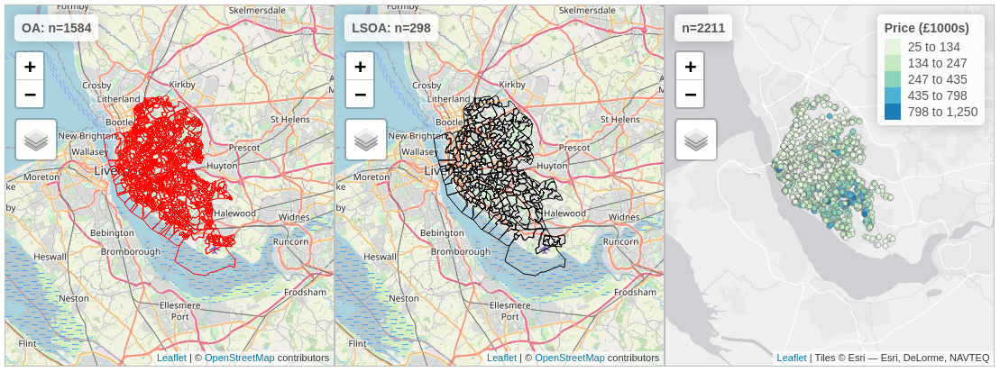

---
output:
  pdf_document:
    toc: false
    includes:
       in_header: codecheck-preamble.sty
---

```{r rsetup,eval=TRUE,include=FALSE}
require(codecheck)
require(knitr)
require(rprojroot)
require(yaml)
require(xtable)
require(tibble)
require(readr)
options(width=60)
opts_chunk$set(cache=FALSE)

root = find_root("codecheck.yml")
```

```{r codecheck_logo, echo=FALSE,results='asis'}
latex_codecheck_logo()
```

```{r manifest, eval=TRUE, include=FALSE}
metadata = codecheck_metadata(root)
manifest = metadata$manifest
```

---
title: `r paste("CODECHECK certificate", metadata$certificate)`
subtitle: `r codecheck:::as_latex_url(metadata$report)`
---

```{r summary_metadata, echo=FALSE, results='asis'}
latex_summary_of_metadata(metadata)
```

```{r summary_manifest, echo=FALSE, results='asis'}
outputs = sapply(manifest, function(x) x$file)
dest_files = file.path(outputs)
manifest_df = data.frame(output = outputs, comment = sapply(manifest, 
        function(x) x$comment), dest = dest_files, size = file.size(dest_files), 
        stringsAsFactors = FALSE)

xt = xtable(manifest_df[, c("output", "comment", "size")],
            digits=0,
            caption="Summary of output files generated")
print(xt, include.rownames=FALSE, comment=FALSE)
```

# Summary

I could reproduce one figure and two tables from the paper.
The code required some small fixes, such as a missing `library()` statement.
I also had to manually create a screenshot of Figure&nbsp;1, but based on a visual inspection the figures from the paper match the ones in the repository and the ones recreated by me.
The numbers in reproduced Tables&nbsp;2 and 3 match the ones in the paper with only small negligible numerical differences on some values.

\newpage

## Reproduction of Figure 1

Screenshot of interactive output.



## Reproduction of Table 2

```{r table2}
readLines("table2.md")
```


## Reproduction of Table 3

```{r table3}
readLines("table3.md")
```

\clearpage

# CODECHECKER notes

Since the authors were not aware of CODECHECK at the time of submission, I did the following preparation steps:

- source the data file locally, because I have no control over the lexcomber/OpeningPractice repository
- manually set the bbox of the plots and enable map sync, so the views match each other; the default for the third plot mismatches the polygon data, because `st_bbox(props_oa)` includes (0,0) as a corner; adjusted the zoom level to more closely match the paper's figure
- saved Figure 1 from the PDF to a file, so it can be added to the manifest
- saved Tables to files so they can be added to the manifest, manually transferring the values from the paper

For details of the preparation steps see commit [`7f52eb2b99087fedd5db0d72f7cea32ddc610013`](https://github.com/codecheckers/OpeningPractice/commit/7f52eb2b99087fedd5db0d72f7cea32ddc610013).

Then I continued with the actual CODECHECK.

------

When starting the check, I had problems installing all required libraries locally (Ubuntu 19.10), where `rgdal` could not be updated when I wanted to install `tmap`. Therefore I switched to an `rocker/geospatial` container with R `4.0.0`, which I started with the following command:

```bash
docker run --rm -it -p 8787:8787 -e PASSWORD=simple \
    -v $(shell pwd):/home/rstudio/OpeningPractice rocker/geospatial:4.0.0
```

From the required libraries, only the repmis package was missing, so I added it to a file `codecheck/install.R`.
Line 31 gave me the following error:

```
TopologyException: Input geom 1 is invalid: Ring Self-intersection at or near point
```

Based on [this issue](https://github.com/r-spatial/sf/issues/347), I wrapped `oa` in `sf::st_make_valid(oa)`, and the error goes away. This was not needed for `lsoa`. I made this change directly in `github_script.R`.
I continued to execute commands line by line, until the function `train()`, which was not available.
I needed to install and load the package `caret`. I made this change directly in `github_script.R`.

With these changes, I could `source()` the whole script file and saved the generated `tableX.md` files into the `codecheck` directory.
The whole script only takes a few moments to run on my computer.

------

## General feedback on the code

- I suggest to make the map titles dependent on the data, i.e. not hardcoding "n=1584" but using `nrow(oa)`.
- The code would also be more readable with more consistent formatting and a few new lines.
- The data should be saved in a more accessible file format, not as a binary `.RData` file; a quick test saving as GeoJSON resulted in a marginally larger but plain text file not limited to R users.
- The maps should be saved from the code, not a screenshot of the interactive view.

\clearpage
# Colophon

**How to cite this report**

> Daniel Nüst. (2020, June 2). CODECHECK certificate 2020-016. Zenodo. http://doi.org/10.5281/zenodo.3873153

**Environment used to create the report** (not conduct the check)

```{r sessionInfo}
sessionInfo()
```

```{r renderCommand, include=FALSE, eval=FALSE}
# render this document from the project root
rmarkdown::render("codecheck/codecheck.Rmd", output_dir = "codecheck")
```

```{r zenodo, include=FALSE, eval=FALSE}
# these commands were used to upload the report and code to zenodo
library("zen4R")
zenodo <- ZenodoManager$new(
   token = zenodoToken, 
   logger = "DEBUG"
)

#record = create_zenodo_record(zenodo)
#metadata = read_yaml("codecheck.yml")
#record = get_zenodo_record(metadata$report)
#codecheck:::set_zenodo_metadata(zenodo, record, metadata)
#codecheck:::set_zenodo_certificate(zenodo, record, "codecheck/codecheck.pdf")

record <- zenodo$getDepositionByConceptDOI("10.5281/zenodo.3981253")
zenodo$uploadFile("codecheck.pdf", record$id)

zip::zipr("OpeningPractice.zip", list.files("."))
zenodo$uploadFile("OpeningPractice.zip", record$id)
```